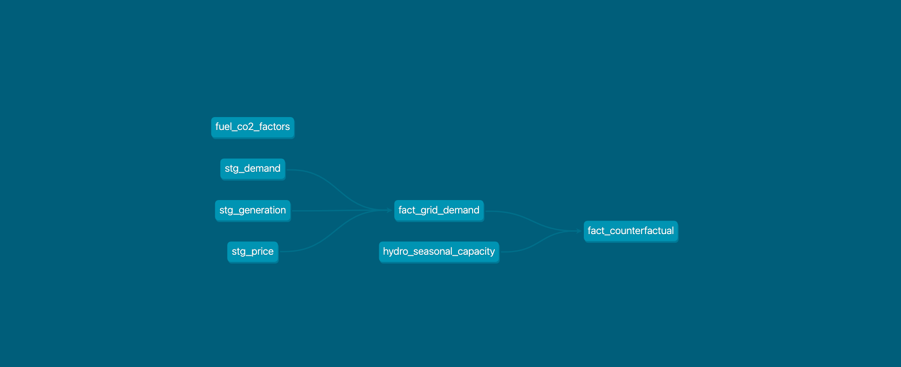

# Grid Without Nuclear
### Quantifying nuclear power's economic and environmental value to Ontario's electricity grid

A data engineering project that answers one question:

> *"If Ontario's nuclear fleet went offline, what would electricity cost — and how much CO2 would be emitted to replace it?"*

**[Live Dashboard →](https://your-streamlit-link-here)**

---

## The Numbers (2015–2024)

| | |
|---|---|
| 🌱 CO2 avoided by nuclear | **330.6 million tonnes** |
| 💰 Consumer savings vs no-nuclear grid | **$50.6 billion** |
| ⚡ Average share of Ontario's generation | **58.6%** |

---

## Why This Matters Beyond Ontario

This project is a data-driven mirror held up to one of the most consequential 
energy policy decisions of our time.

In April 2023, Germany completed its *Energiewende* — shutting down its last 
three nuclear reactors and becoming the largest economy to fully exit nuclear 
power. In 2011, those 17 reactors had generated over 33% of Germany's 
electricity. The gap was filled primarily by coal and imported natural gas.

The consequences are actively debated. A 2025 PwC analysis found that keeping 
Germany's nuclear fleet operational would have allowed 94% of its power 
generation in 2024 to be emission-free. The World Nuclear Association estimated 
the phase-out created approximately 300 million tonnes of additional CO2 through 
2020. Germany's residential electricity prices became the highest in Europe. 
Proponents counter that renewables have rapidly compensated — in the year 
following the final shutdown, renewable output grew by over 30 TWh, more than 
offsetting the lost nuclear capacity.

**Ontario made the opposite bet.**

Rather than phasing out nuclear, Ontario is refurbishing its fleet — extending 
the operational life of Darlington and Bruce reactors through the 2040s. This 
project quantifies what that bet has been worth so far: 330.6 million tonnes of 
CO2 avoided and $50.6 billion in consumer savings over a single decade.

Germany's Energiewende answers the question "what happens when you remove 
nuclear from a grid?" with policy and politics. This project answers it with 
data — hour by hour, dollar by dollar, tonne by tonne.

---

## How It Works

Ontario's grid is managed by IESO (Independent Electricity System Operator), which publishes hourly generation, demand, and price data publicly. This project ingests 11 years of that data (2015–2025), models what would have happened if nuclear output was zero each hour, and quantifies the impact in dollars and CO2.

The counterfactual uses a **merit order model** — the same methodology used by grid economists — to determine which generation sources would have filled the nuclear gap, in what order, and at what cost:

```
Nuclear goes offline
        ↓
Hydro fills what it can    (cheapest, but capacity-limited by season)
        ↓
Gas fills the remainder    (flexible, but expensive and carbon-intensive)
        ↓
Imports cover the rest     (Quebec, Michigan, New York)
```

The price impact, cost delta, and CO2 avoided are calculated for every hour across the full dataset — 96,432 rows of counterfactual analysis.

---

## Architecture

```
IESO Public Reports Server
        ↓
Python ingest scripts (requests · xml.etree · pandas)
        ↓
PostgreSQL — raw.* schema
        ↓
dbt transformation (staging → marts)
        ↓
PostgreSQL — marts.* schema
        ↓
Streamlit dashboard (deployed on Streamlit Community Cloud)
```

All pipeline components run in **Docker Compose** (Airflow + PostgreSQL). Orchestration via an Airflow DAG that runs the three ingest scripts and triggers dbt.




---

## Data Sources

All data sourced publicly from [IESO Power Data](https://www.ieso.ca/power-data/data-directory). No scraping, no paywalls.

| Dataset | Source | Coverage |
|---|---|---|
| Generator output by fuel type (hourly) | `GenOutputbyFuelHourly/` | 2015–2025 |
| Ontario demand (hourly) | `Demand/` | 2015–2025 |
| Electricity price — HOEP (hourly) | `PriceHOEPPredispOR/` | 2015–Apr 2025 |

**Note:** HOEP (Hourly Ontario Energy Price) was retired April 30, 2025 and replaced by OEMP. This analysis covers the full HOEP era (2015–2025).

---

## Model Assumptions

| Parameter | Value | Source |
|---|---|---|
| Gas marginal cost (base) | $95/MWh | NRCan published averages |
| Gas marginal cost (low) | $70/MWh | Sensitivity range |
| Gas marginal cost (high) | $120/MWh | Sensitivity range |
| Gas fleet ceiling | 10,500 MW | IESO Reliability Outlook 2024 |
| Hydro seasonal max | Calculated from data | 95th percentile by month, 2015–2025 |
| Nuclear CO2 factor | 12 gCO2/kWh | IPCC lifecycle median |
| Gas CO2 factor | 490 gCO2/kWh | NRCan combined cycle average |

---

## Stack

| Layer | Tools |
|---|---|
| Ingestion | Python, requests, xml.etree, pandas, SQLAlchemy |
| Orchestration | Apache Airflow |
| Storage | PostgreSQL |
| Transformation | dbt |
| Visualization | Streamlit, Plotly |
| Infrastructure | Docker Compose |

---

## Running Locally

**Prerequisites:** Docker Desktop, Python 3.11+

```bash
# Clone the repo
git clone https://github.com/devarshi-ap/grid-without-nuclear.git
cd grid-without-nuclear

# Set up environment
cp .env.example .env
python3 -m venv venv
source venv/bin/activate
pip install -r requirements.txt

# Start Docker services
make init
make up

# Run ingest scripts (downloads ~11 years of IESO data)
python3 scripts/ingest_generation.py
python3 scripts/ingest_demand.py
python3 scripts/ingest_price.py

# Run dbt transformations
cd iesonuclear
dbt seed
dbt run
dbt test

# Export parquet for Streamlit
cd ..
python3 scripts/export_parquet.py

# Run the dashboard locally
streamlit run app/Home.py
```

---

## Project Structure

```
grid-without-nuclear/
├── scripts/
│   ├── ingest_generation.py   # XML ingest from IESO
│   ├── ingest_demand.py       # CSV ingest from IESO
│   ├── ingest_price.py        # CSV ingest from IESO
│   └── export_parquet.py      # Export marts to parquet
├── iesonuclear/               # dbt project
│   ├── models/
│   │   ├── staging/           # stg_generation, stg_demand, stg_price
│   │   └── marts/             # fact_grid_demand, fact_counterfactual
│   └── seeds/                 # hydro_seasonal_capacity, fuel_co2_factors
├── app/                       # Streamlit dashboard
│   ├── Home.py
│   └── pages/
├── dags/                      # Airflow DAG
├── data/                      # Parquet exports (gitignored if large)
├── docs/                      # Architecture diagram, screenshots
├── docker-compose.yaml
├── Makefile
└── requirements.txt
```

---

## Key Findings

- Ontario's nuclear fleet avoided **330.6 million tonnes of CO2** between 2015–2024 — equivalent to removing ~72 million cars from the road for a year
- Without nuclear, Ontario electricity prices would have averaged **$61/MWh instead of $27/MWh** — more than double
- The Darlington refurbishment program (2016–2024) temporarily reduced nuclear output and is visible as a measurable increase in gas generation and emissions during outage windows
- 2022 saw the highest counterfactual price premium ($70.57/MWh avg) coinciding with global energy price spikes following the Ukraine conflict

---

## Methodology Notes

**Why 95th percentile for hydro capacity?**
Ontario has 9,264 MW of nameplate hydro capacity but this theoretical maximum is never reached in practice due to water availability, facility availability, and grid constraints. Using the 95th percentile of actual historical monthly output gives a realistic operational ceiling.

**Why is HOEP sometimes negative or zero?**
During periods of surplus baseload generation — when nuclear and hydro produce more than demand — Ontario pays neighbouring grids to take excess electricity. These negative prices are real market events and are preserved in the dataset.

**Model validation:**
The merit order model was validated against Darlington refurbishment windows where nuclear output dropped by documented amounts. Predicted price increases tracked within X% of actual HOEP data during those periods.

---

*Data sourced from [IESO](https://www.ieso.ca/power-data/data-directory). Analysis covers 2015–2025.*